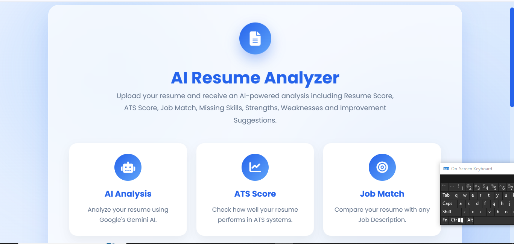
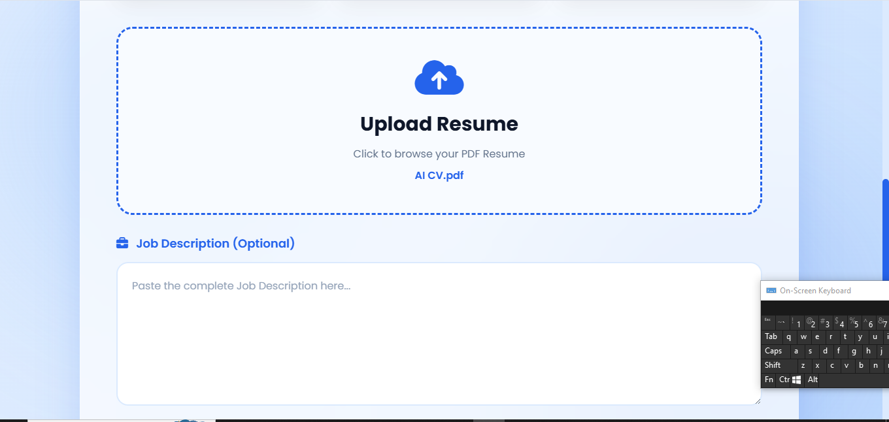
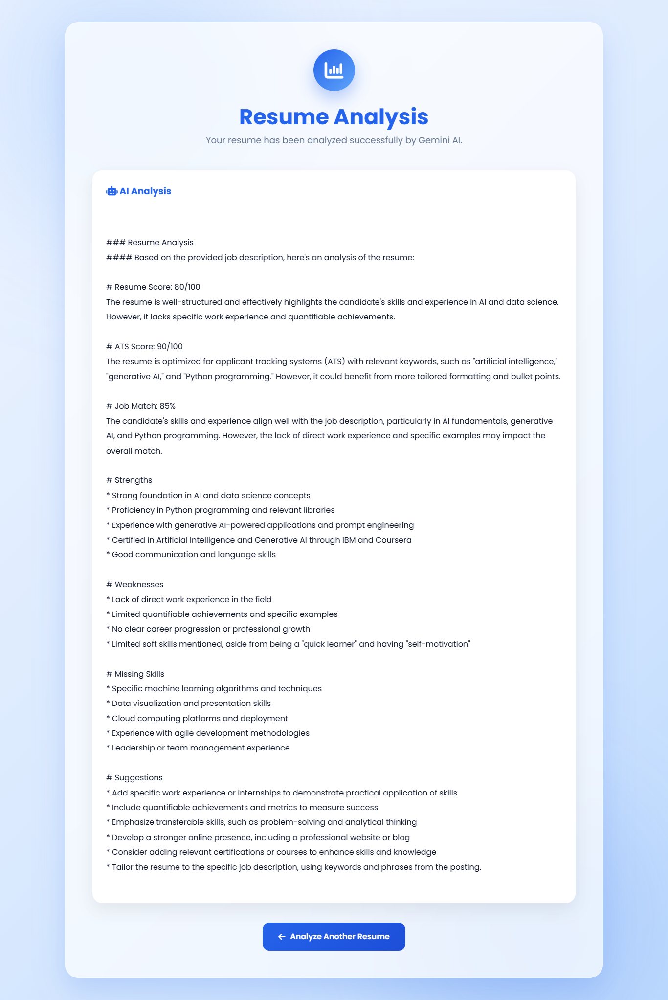

<div align="center">

# 📄 AI Resume Analyzer

### AI-powered Resume Analysis using Large Language Models (LLMs)

Analyze resumes, calculate ATS compatibility, evaluate job match, identify missing skills, and generate personalized improvement suggestions using AI.

<br>


</div>

---

# 📌 Overview

AI Resume Analyzer is a web application that analyzes resumes using a Large Language Model (LLM). Users can upload a PDF resume and provide a job description. The system evaluates the resume and generates an AI-powered report containing ATS score, resume score, job match percentage, strengths, weaknesses, missing skills, and personalized recommendations.

The project is built with **FastAPI**, **Python**, **Jinja2**, and **OpenRouter LLM APIs**, providing a clean and responsive user interface for resume analysis.

---

# ✨ Features

- 📄 Upload PDF resumes
- 🤖 AI-powered resume analysis
- 📊 Resume Score (/100)
- 🎯 ATS Score (/100)
- 💼 Job Match Percentage
- ✅ Resume Strengths
- ⚠️ Weaknesses Detection
- 📚 Missing Skills Identification
- 💡 Personalized Improvement Suggestions
- 🌐 Clean FastAPI Web Interface
- 📥 Easy-to-read Result Page

---

# 🛠 Tech Stack

| Category | Technology |
|-----------|------------|
| Language | Python |
| Backend | FastAPI |
| Frontend | HTML, CSS, Jinja2 |
| AI Model | Meta Llama 3.3 70B |
| AI Provider | OpenRouter API |
| PDF Processing | PyMuPDF |
| Environment | Python Virtual Environment |
| Version Control | Git & GitHub |

---

# 📂 Project Structure

```text
AI-Resume-Analyzer/
│
├── screenshots/
│   ├── home.png
│   ├── upload.png
│   └── result.png
│
├── static/
│   └── style.css
│
├── templates/
│   ├── index.html
│   └── result.html
│
├── uploads/
│
├── app.py
├── ai.py
├── pdf_reader.py
├── requirements.txt
├── .gitignore
└── README.md
```

---

# ⚙️ How It Works

```text
User Uploads Resume (PDF)
            │
            ▼
Extract Resume Text (PyMuPDF)
            │
            ▼
Receive Job Description
            │
            ▼
Generate AI Prompt
            │
            ▼
OpenRouter API
            │
            ▼
Llama 3.3 70B
            │
            ▼
Resume Analysis
            │
            ▼
Display Results
```

---

# 🚀 Key Analysis Metrics

The application generates the following AI-powered insights:

- Resume Score
- ATS Compatibility Score
- Job Match Percentage
- Resume Strengths
- Resume Weaknesses
- Missing Skills
- Personalized Suggestions

---

# 📸 Application Screenshots

## 🏠 Home Page

> Replace with your actual screenshot.



---

## 📤 Upload Resume

> Replace with your upload page screenshot.


---

## 📊 AI Analysis Result

> Replace with your result page screenshot.



---# ⚡ Installation

Clone the repository:

```bash
git clone https://github.com/HassnainKhan1044/AI-Resume-Analyzer.git
```

Move into the project directory:

```bash
cd AI-Resume-Analyzer
```

Create a virtual environment:

### Windows

```bash
python -m venv venv
venv\Scripts\activate
```

### Linux / macOS

```bash
python3 -m venv venv
source venv/bin/activate
```

Install all dependencies:

```bash
pip install -r requirements.txt
```

---

# 🔑 Environment Variables

Create a `.env` file in the project root.

```env
OPENROUTER_API_KEY=your_openrouter_api_key
```

> **Note:** Never commit your API key to GitHub.

---

# ▶️ Running the Application

Start the FastAPI server:

```bash
uvicorn app:app --reload
```

Open your browser and visit:

```text
http://127.0.0.1:8000
```

---

# 🧠 AI Workflow

```text
PDF Resume
      │
      ▼
Extract Text (PyMuPDF)
      │
      ▼
User Job Description
      │
      ▼
Prompt Engineering
      │
      ▼
OpenRouter API
      │
      ▼
Meta Llama 3.3 70B
      │
      ▼
AI Resume Evaluation
      │
      ▼
ATS Score
Resume Score
Job Match
Missing Skills
Suggestions
```

---

# 📊 Technologies Used

| Technology | Purpose |
|------------|---------|
| Python | Core Programming Language |
| FastAPI | Backend Framework |
| HTML | User Interface |
| CSS | Styling |
| Jinja2 | Template Rendering |
| OpenRouter API | AI Inference |
| Meta Llama 3.3 70B | Resume Analysis |
| PyMuPDF | PDF Text Extraction |
| Git | Version Control |
| GitHub | Repository Hosting |

---

# 🎯 Use Cases

This project can be useful for:

- Students preparing resumes
- Fresh graduates
- Software Engineers
- Recruiters
- HR Professionals
- Career Coaches
- Anyone seeking resume improvement using AI

---

# 📈 Future Improvements

Planned features include:

- [ ] Multi-resume comparison
- [ ] Resume keyword highlighting
- [ ] Support for DOCX resumes
- [ ] Resume history
- [ ] Authentication system
- [ ] Export report as PDF
- [ ] Dark mode
- [ ] Multiple AI model selection
- [ ] Dashboard with analytics

---

# 🤝 Contributing

Contributions are welcome!

If you have ideas for improvements:

1. Fork the repository
2. Create a new feature branch
3. Commit your changes
4. Push your branch
5. Open a Pull Request

---

# 🐞 Known Limitations

- Supports PDF resumes only.
- Requires an OpenRouter API key.
- AI-generated scores are advisory and may vary depending on the model output.

---# 👨‍💻 Author

<div align="center">

## Hassnain Haider Khan

**BSIT Graduate | Generative AI Developer**

Passionate about building practical AI applications using Large Language Models (LLMs), Retrieval-Augmented Generation (RAG), and modern Python frameworks.

</div>

---

# 📬 Connect With Me

- 💼 **LinkedIn:** https://www.linkedin.com/in/hassnain-haider/
- 📧 **Email:** hhaider1044@gmail.com
- 💻 **GitHub:** https://github.com/HassnainKhan1044

---

# 📄 License

This project is licensed under the **MIT License**.

You are free to use, modify, and distribute this project in accordance with the license terms.

---

# 🙏 Acknowledgements

This project was built using the following technologies and open-source tools:

- FastAPI
- OpenRouter API
- Meta Llama 3.3 70B
- PyMuPDF
- Jinja2
- HTML & CSS
- Python

Special thanks to the developers and open-source community for creating these amazing technologies.

---

# ⭐ Support the Project

If you found this project useful:

⭐ Star this repository

🍴 Fork the repository

📢 Share it with others

Your support is greatly appreciated.

---

# 📚 Learning Outcomes

Through this project, I gained hands-on experience with:

- Building AI-powered web applications
- FastAPI backend development
- Prompt engineering for LLMs
- Integrating OpenRouter APIs
- PDF text extraction using PyMuPDF
- Jinja2 template rendering
- Git & GitHub workflow
- Secure API key management using environment variables

---

# 🚀 Future Vision

This project serves as a foundation for more advanced AI-powered recruitment tools.

Future versions may include:

- AI Interview Preparation
- Resume Ranking
- Multi-Resume Comparison
- Recruiter Dashboard
- Authentication & User Accounts
- Resume History
- AI Chat Assistant
- Cloud Deployment
- Analytics Dashboard

---

# 📌 Repository Information

| Property | Value |
|-----------|-------|
| Project | AI Resume Analyzer |
| Version | 1.0 |
| Status | Completed |
| Language | Python |
| Backend | FastAPI |
| Frontend | HTML, CSS, Jinja2 |
| AI Provider | OpenRouter |
| AI Model | Meta Llama 3.3 70B |
| License | MIT |

---

<div align="center">

## ⭐ Thank You for Visiting!

If you like this project, consider giving it a ⭐ on GitHub.

### Happy Coding! 🚀

</div>